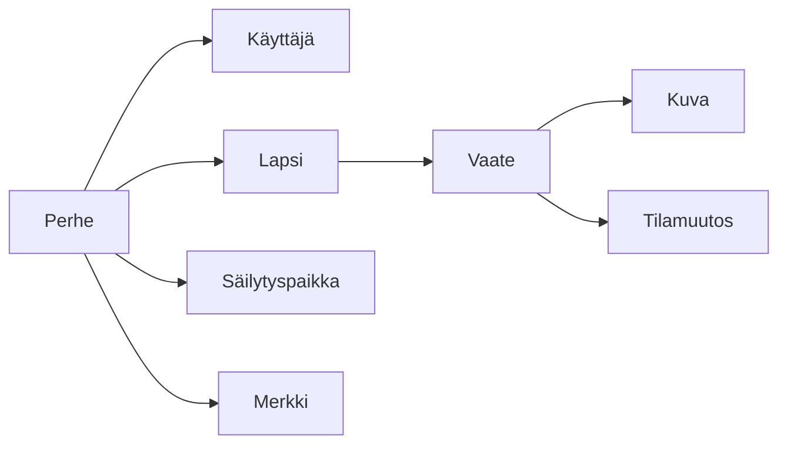
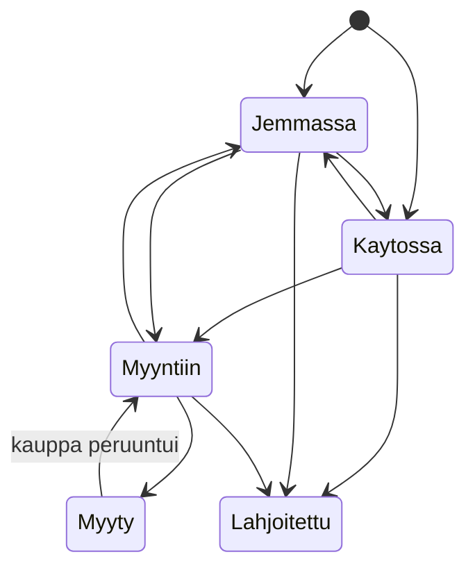
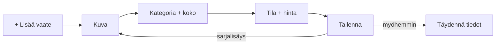

# Lastenvaatteiden hallintasovellus – MVP-määrittely v0.2

2026-09-16 · @Someone

## Idea ja ydinperiaate

Mobiilisovellus, jolla vanhempi hallitsee yhden lapsen vaatevarastoa: mitä on käytössä, mitä jemmassa, missä laatikossa, ja mitä voi laittaa myyntiin. Vaate seurataan hankinnasta käytön kautta myyntiin, lahjoittamiseen tai poistamiseen.

Sovellus on selattava ja haettava digitaalinen vaatevarasto, ei tilastosovellus. Sen pitää olla helpompi käyttää kuin Excel tai puhelimen muistiinpanot.

Käyttökokemuksen periaate: **kuva → tärkeimmät tiedot → tallenna → täydennä myöhemmin.** Käyttäjä ei koskaan joudu täyttämään kaikkea kerralla.

MVP:n onnistumisen mittari: palaako vanhempi sovellukseen selvittääkseen, mitä lapsen vaatevarastossa oikeasti on. Sovellus onnistuu, jos käyttäjä löytää nopeasti vastauksen tyyliin "6 kpl koon 110 housuja, joista 3 käytössä ja 3 jemmassa sinisessä laatikossa".

## Muutokset alkuperäiseen määrittelyyn

Tämä versio perustuu alkuperäiseen määrittelyyn ja sen kriittiseen arvioon 16.9.2026. Leikkauslista hyväksyttiin sellaisenaan.

| Muutos | Mitä | Miksi |
| --- | --- | --- |
| Lisätty | Sarjalisäys (alkusyöttö) | Ensimmäinen käyttökerta on satojen vaatteiden kirjaus, ei yksi vaate kerrallaan |
| Lisätty | Kappalemäärä vaatteelle | Sukkia ja bodyja ei kuvata yksitellen |
| Lisätty | Vapaaehtoinen nimi / kuvaus | Kaksi Reiman haalaria pitää erottaa listassa; haku nimellä vaatii nimen |
| Lisätty | Hankintatapa: lahjaksi saatu | Iso osa lastenvaatteista tulee lahjana tai suvun kierrosta |
| Lisätty | Kova poisto | Väärin lisätty vaate ei ole "lahjoitettu" |
| Lisätty | Tilamuutoksen päivämäärän muokkaus | Ilman sitä historia on epäluotettava |
| Lisätty | Perhe-taso tietomalliin | Halpa nyt, säästää migraation kun yhteiskäyttö tulee |
| Lisätty | Jemmassa-tilan alatyyppi | "Tulossa käyttöön" ja "jäänyt pieneksi" ovat eri kasoja |
| Leikattu | Tarpeet / tavoitemäärät | Kokokoonti vastaa jo kysymykseen; lisätyötä käyttäjälle |
| Leikattu | Talous omana osiona ja pakettiosto-rakenne | Tukitoiminto; hinnat tallennetaan, koonnit myöhemmin |
| Leikattu | Käyttöaikalaskenta ja elinkaarikoonti | Data kerätään, mutta väärä luku syö luottamusta enemmän kuin puuttuva |
| Leikattu | Omat kategoriat | Kiinteä lista + "Muu" riittää; kategoriahallinta on työlästä |
| Leikattu | Myyntikanava | Ei palvele ydinkysymystä |
| Leikattu | Väri | Kuva kertoo värin; ei suodatin |
| Auki | Offline-toiminta | Päätetään ennen arkkitehtuurivalintaa |

## Tietomalli

Tietomallissa on perhe-taso alusta asti, vaikka MVP:n käyttöliittymässä on yksi käyttäjä ja yksi lapsi. Vaate kuuluu lapseen, ja lapsi perheeseen; vaatteen siirto toiselle lapselle on myöhemmin viiteavaimen vaihto, ei migraatio.

Merkit ja säilytyspaikat ovat perheen, eivät lapsen, omaisuutta: sama laatikko voi sisältää myöhemmin kahden lapsen vaatteita.

| Olio | Kentät MVP:ssä |
| --- | --- |
| Perhe | id, luontipäivä |
| Käyttäjä | id, perhe, sähköposti / kirjautumistunniste |
| Lapsi | id, perhe, nimi, nykyinen koko (valinnainen) |
| Vaate | id, lapsi, kentät osiossa "Vaatteen tiedot", nykyinen tila, luontipäivä, poistettu-lippu |
| Kuva | id, vaate, tiedosto, pikkukuva, järjestys |
| Tilamuutos | id, vaate, tila josta, tila johon, päivämäärä (muokattavissa), kirjausaika |
| Merkki | id, perhe, nimi (normalisoitu) |
| Säilytyspaikka | id, perhe, nimi (normalisoitu) |

Tilamuutokset tallennetaan aina. Muita kenttämuutoksia ei versioida MVP:ssä.

## Vaatteen tiedot

Pakollisia ovat vain kategoria, koko ja tila. Kaikki muu voidaan täydentää myöhemmin.

| Kenttä | Pakollinen | Muoto | Huomio |
| --- | --- | --- | --- |
| Kategoria | kyllä | valinta kiinteästä listasta | ks. Kategoriat |
| Koko | kyllä | valinta listasta tai oma arvo | ks. Koot |
| Tila | kyllä | valinta | oletus lisäyksessä: Jemmassa |
| Kuvat | ei | 0–5 kuvaa | kamera tai kuvakirjasto; ensimmäinen on pääkuva |
| Nimi / kuvaus | ei | lyhyt teksti | esim. "sininen dinohaalari"; näkyy listarivissä |
| Kappalemäärä | ei | kokonaisluku, oletus 1 | sukat, bodyt, pipot yhtenä rivinä |
| Merkki | ei | valinta aiemmista tai uusi | "Ei merkkiä / tuntematon" sallittu |
| Hankintatapa | ei | Uutena / Käytettynä / Lahjaksi saatu | lahja → ostohinta 0 |
| Ostohinta | ei | euroa, desimaalit | koko rivin hinta, ei per kappale |
| Ostopäivä | ei | päivämäärä |  |
| Kunto | ei | Uusi / Erinomainen / Hyvä / Tyydyttävä / Huono |  |
| Mainittavat asiat | ei | vapaa teksti | tahrat, kuluma; tärkeä myynnissä |
| Säilytyspaikka | ei | valinta aiemmista tai uusi |  |
| Sesonki | ei | Kevät / Kesä / Syksy / Talvi / Ympärivuotinen, monivalinta | välikausitakki = Kevät + Syksy |

Listarivissä näytetään pääkuva, nimi tai kategoria + merkki, koko, kappalemäärä jos > 1, ja säilytyspaikka.

## Vaatteen lisääminen

Lisäyksessä on kaksi tilaa: yksittäinen nopea lisäys ja sarjalisäys alkusyöttöön. Molemmissa tallennus onnistuu, kun kategoria, koko ja tila on annettu.

**Nopea lisäys** on kirpputoritilanne: kuva, kategoria, koko, ostohinta, hankintatapa, tila, tallenna. Muut kentät ovat samalla lomakkeella "Lisää tietoja" -osion takana, eivät erillisellä sivulla.

**Sarjalisäys** on laatikko kerrallaan -tilanne. Käyttäjä antaa kerran yhteiset tiedot (tila, koko, säilytyspaikka, sesonki) ja kirjaa sitten vaatteita peräkkäin: kuva + kategoria + tallenna + seuraava. Yhteiset tiedot säilyvät esitäytettyinä ja niitä voi muuttaa kesken sarjan. Kuvan voi ohittaa.

Kun sarjalisäyksessä kirjataan jo käytössä olevia vaatteita, käyttöjakson alkupäiväksi kysytään kerran arvio ("käytössä noin syyskuusta 2026"), ei kirjauspäivää.

Tavoite: yhden vaatteen kirjaus sarjalisäyksessä kestää alle 10 sekuntia.

## Tilat ja siirtymät

Vaatteella on aina yksi tila. Jemmassa-tilalla on alatyyppi, joka kertoo suunnan: *tulossa käyttöön* (ostettu tulevaa kokoa varten) tai *jäänyt pieneksi* (odottaa päätöstä tai sisarusta). Käyttöliittymässä se näkyy yhtenä tilana, jonka voi suodattaa alatyypin mukaan.

Myyty ja Lahjoitettu / poistettu ovat päätetiloja, joista palataan vain virheen korjaamiseksi. Vaatetta ei koskaan poisteta tietokannasta tilamuutoksella; historia säilyy.

Jokainen tilamuutos kirjaa päivämäärän, jonka oletus on tämä päivä. **Päivämäärän voi muuttaa** siirron yhteydessä ja jälkikäteen historiasta, koska käyttäjä siirtää tilan usein viikkoja myöhässä. Käyttöjakso alkaa siirrosta Käytössä-tilaan ja päättyy seuraavaan siirtoon pois siitä, mihin tahansa tilaan.

Tilan voi vaihtaa suoraan listan riviltä ilman vaatteen avaamista.

**Kova poisto** on erillinen toiminto vaatteen sivulla, vahvistuksella. Se on tarkoitettu virheellisesti tai tuplana lisätyille vaatteille ja poistaa vaatteen, kuvat ja historian kokonaan.

## Koot, kategoriat, merkit ja säilytyspaikat

**Koko** on valinta listasta, jolla on määritelty järjestys, jotta kokokoonti ja lajittelu toimivat. Vapaa teksti ei riitä, koska "92/98" ja "2–3 v" hajottaisivat koonnit. Käyttäjä voi lisätä oman koon, joka sijoitetaan listaan käyttäjän valitsemaan kohtaan.

| Kokoryhmä | Arvot MVP:ssä |
| --- | --- |
| Senttikoot | 50, 56, 62, 68, 74, 80, 86, 92, 98, 104, 110, 116, 122, 128, 134, 140, 146, 152, 158, 164, 170 |
| Kirjainkoot | XS, S, M, L, XL |
| Kengät | 16–40 |
| Yleiset | Onesize, muu (oma arvo) |

**Kategoriat** ovat MVP:ssä kiinteä lista + "Muu": Paidat, Housut, Mekot ja hameet, Haalarit, Takit, Ulkovaatteet, Yövaatteet, Alusvaatteet, Sukat, Asusteet, Kengät, Uima- ja harrastusvaatteet, Muu. Omat kategoriat tulevat myöhemmin.

**Merkit** kirjoitetaan itse ja ehdotetaan seuraavalla kerralla. Tallennuksessa nimi normalisoidaan: välilyönnit siivotaan ja vertailu tehdään kirjainkoosta riippumatta, jotta "reima" ja "Reima " ovat sama merkki. Merkin voi nimetä uudelleen asetuksissa, jolloin kaikki sen vaatteet päivittyvät.

**Säilytyspaikat** toimivat samalla tavalla: vapaa nimi, ehdotus aiemmista, sama normalisointi ja uudelleennimeys asetuksissa. Säilytyspaikan sivulta näkee, mitä siellä on.

## Haku, suodatus ja koonnit

Etusivun yläosassa on hakukenttä, joka hakee nimestä, merkistä, kategoriasta, koosta ja mainittavista asioista. Suodattimet: tila, koko, kategoria, merkki, sesonki, kunto, säilytyspaikka. Suodattimet toimivat yhdessä ja näkyvät valittuina listan yläpuolella.

Lapsen näkymä näyttää tilat lukumäärineen: Käytössä, Jemmassa, Myyntiin, Myyty, Lahjoitettu / poistettu, Kaikki vaatteet. Lukumäärä laskee kappalemäärät yhteen, ei rivejä.

**Kaikki vaatteet** on lista koko varastosta, jossa haku ja suodattimet toimivat tilasta riippumatta.

Listojen oletusjärjestys on viimeksi muokattu ensin. Vaihtoehdot: koko, kategoria, lisäyspäivä.

**Kokokoonti** vastaa kysymykseen "mitä meillä on koossa 110": valittu koko, ja sen alla kategoriat lukumäärineen jaettuna Käytössä ja Jemmassa -sarakkeisiin. Riviä napauttamalla avautuu suodatettu lista. Lapsen nykyinen koko on esivalittuna, jos se on annettu.

**Kategoriakoonti** on sama toisin päin: valittu kategoria, koot riveinä.

## Myynti ja talous

Myynti on MVP:ssä tila ja lista, ei oma sovelluksen osio. Myyntiin-lista näyttää kuvan, nimen tai kategorian, koon, merkin, kunnon, mainittavat asiat ja ostohinnan, jotta käyttäjä näkee nopeasti, mitä on myymässä.

Kun vaate merkitään myydyksi, kysytään myyntihinta ja myyntipäivä (oletus tämä päivä). Myyntikanavaa ei kysytä. Kappalemäärärivi myydään kokonaisena; osittainen myynti ei kuulu MVP:hen.

Talous on yksi yhteenvetokortti asetuksissa tai lapsen näkymän alalaidassa, kolme lukua: vaatteisiin käytetty, myynneistä saatu, erotus. Ostohinta ja myyntihinta tallennetaan aina, jotta tarkemmat koonnit voi rakentaa myöhemmin kertyneestä datasta.

Pakettiostolle ei ole omaa rakennetta. Käyttäjä syöttää itse arvion per rivi tai jättää hinnan tyhjäksi; sarjalisäyksessä hinnan voi antaa yhteisenä tietona, jolloin se kopioituu jokaiselle riville.

## Navigaatio ja käyttäjäpolut

Alareunassa on kolme kohdetta ja yksi korostettu toiminto: **Etusivu** · **Koonnit** · **Asetukset**, ja keskellä **+ Lisää vaate**. Erillinen Vaatteet-välilehti poistettiin, koska etusivu on jo vaatelista; Myynti ja Talous poistettiin päätasolta edellä kuvatuista syistä.

| Näkymä | Sisältö |
| --- | --- |
| Etusivu | Haku ja suodattimet, lapsen tilat lukumäärineen, Kaikki vaatteet |
| Koonnit | Kokokoonti, kategoriakoonti, säilytyspaikat |
| Asetukset | Lapsi, merkit, säilytyspaikat, talouskortti, tili, tietojen vienti, tilin poisto |
| + Lisää vaate | Nopea lisäys; vaihto sarjalisäykseen |

Siirto käyttöön: Jemmassa-listan riviltä "Siirrä käyttöön", päivämäärä oletuksena tänään ja muutettavissa samassa dialogissa.

Myynti: riviltä "Siirrä myyntiin" → Myyntiin-lista → "Merkitse myydyksi" → hinta + päivä → historia säilyy.

## Reunaehdot

**Tili ja tallennus.** Käyttäjätili on pakollinen ja tiedot tallennetaan pilveen, jotta puhelimen vaihto ei hävitä mitään. Tilin poisto ja tietojen vienti (vaatteet CSV:nä + kuvat zip-pakettina) kuuluvat MVP:hen; sovelluskaupat vaativat tilin poiston.

**Kuvat.** Kuvat pakataan laitteella ennen lähetystä (pitkä sivu enintään 1600 px) ja niistä tehdään pikkukuva listoja varten. Enintään 5 kuvaa per vaate. Kuvat ovat sovelluksen suurin tallennus- ja kustannuserä, joten rajat kannattaa pitää tiukkoina alusta asti.

**Tietosuoja.** Tiedot koskevat lasta ja kuvat voivat sisältää lapsen. Sovelluksessa ohjataan kuvaamaan vaate, ei lasta, ja tietosuojaseloste kirjoitetaan ennen julkaisua. Lapsesta tallennetaan vain nimi ja nykyinen koko.

## Avoimet päätökset

Nämä päätetään ennen toteutuksen aloittamista. Offline on niistä painavin, koska se vaikuttaa arkkitehtuuriin.

- [ ] **Offline-toiminta.** Pidetään auki. Vaihtoehdot: (a) vaatii verkon aina, yksinkertaisin; (b) lisäys ja tilamuutos toimivat offline ja synkronoituvat myöhemmin, mikä vaatii paikallisen tietokannan ja ristiriitojen käsittelyn. Kirjaustilanteet (kirpputori, kellari) puoltavat b:tä.
- [ ] **Alusta.** iOS, Android vai molemmat; vaikuttaa teknologiavalintaan (natiivi vs. Flutter / React Native).
- [ ] **Kirjautumistapa.** Sähköposti + salasana, Apple / Google -kirjautuminen, vai molemmat. Apple-kirjautuminen on pakollinen iOS:ssä, jos muita kolmannen osapuolen kirjautumisia tarjotaan.
- [ ] **Pilvipalvelu.** Esimerkiksi Firebase tai Supabase; valinta riippuu offline-päätöksestä.
- [ ] **Kuvien säilytys.** Kustannusarvio, kun käyttäjällä on 300 vaatetta ja 2 kuvaa per vaate.
- [ ] **Ansaintamalli.** Ilmainen, kertamaksu vai tilaus; vaikuttaa siihen, mitä rajoja ilmaisversioon tulee.
- [ ] **Kokolistan lopullinen sisältö.** Ehdotus yllä; tarkistetaan käyttäjien kanssa.

## MVP:n ulkopuolella ja myöhemmät ideat

Ensimmäiseen versioon ei oteta seuraavia. Ne arvioidaan todellisen käyttäjäpalautteen perusteella.

| Ominaisuus | Miksi myöhemmin |
| --- | --- |
| Useampi lapsi ja vaatteen siirto lapselta toiselle | Tietomalli tukee jo; käyttöliittymä myöhemmin |
| Perheen yhteiskäyttö | Perhe-taso on mallissa; kutsut ja oikeudet myöhemmin |
| Tarpeet / tavoitemäärät | Leikattu MVP:stä |
| Omat kategoriat tai tagit | Kiinteä lista + Muu riittää aluksi |
| Käyttöaikalaskenta ja vaatteen elinkaarikoonti | Historia kerätään alusta asti, näyttö myöhemmin |
| Kehittyneempi talousseuranta (nettokustannus, €/käyttökuukausi, pakettiostot) | Hinnat tallennetaan; koonnit myöhemmin |
| Myyntikanava, myyntikulut, ostajan tiedot | Ei palvele ydinkysymystä |
| Automaattinen myynti-ilmoitusteksti | Rakentuu kunto + mainittavat asiat -kenttien päälle |
| Myyntierät (useita vaatteita yhtenä pakettina) |  |
| Väri | Kuva riittää |
| Lainassa-tila | Tuli esiin arviossa; harkitaan palautteen perusteella |
| Push-ilmoitukset, QR-/viivakoodit, selainversio |  |
| Älykkäät ominaisuudet: kategoria tai merkki kuvasta, OCR kokolapusta, kunnon ehdotus |  |

Näistä luontevin seuraava askel MVP:n jälkeen on useampi lapsi, koska se on alkuperäisen ongelman jatko ja tietomalli on siihen valmis.
