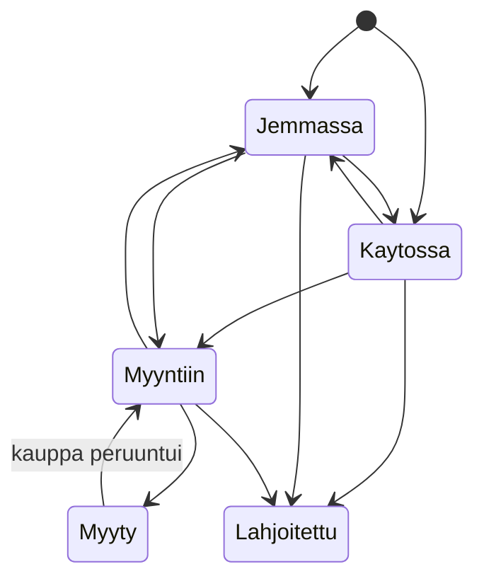
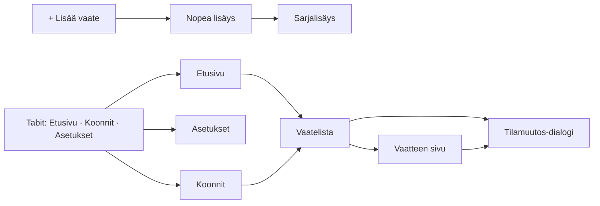

# Toteutussuunnitelma – lastenvaatesovellus MVP

2026-09-16 · @Someone

Suunnitelma pohjautuu MVP-määrittelyyn v0.2 (16.9.2026). Koodia ei vielä kirjoiteta – tässä päätetään mitä rakennetaan, mistä osista ja missä järjestyksessä.

## Lähtökohdat määrittelystä

Toteutus rakennetaan niin, että määrittelyn ydinperiaate toteutuu ensin: kuva → kategoria + koko → tila → tallenna, alle 10 sekuntia per vaate sarjalisäyksessä. Kaikki muu on tämän päälle rakennettavaa täydennystä.

Suunnitelman reunaehdot suoraan määrittelystä ([MVP-määrittely v0.2](https://claude.ai/code/artifact/eca0f1d5-7125-4d24-9489-f1c1ee5d5a30)):

- Käyttäjätili on pakollinen ja tiedot ovat pilvessä; tilin poisto ja tietojen vienti (CSV + kuvat zip) ovat MVP:ssä.
- Tietomallissa on perhe-taso alusta asti, vaikka käyttöliittymä näyttää yhden käyttäjän ja yhden lapsen.
- Tilamuutokset tallennetaan aina historiaksi, päivämäärä on muokattavissa; muita kenttiä ei versioida.
- Koko ja kategoria ovat kiinteitä listoja (koko: oma arvo sallittu), merkit ja säilytyspaikat normalisoituja vapaita nimiä.
- Kuvat pakataan laitteella (pitkä sivu ≤ 1600 px), pikkukuva listoihin, enintään 5 kuvaa per vaate.
- Navigaatio: Etusivu · Koonnit · Asetukset + korostettu "Lisää vaate".

Avoimista päätöksistä tämä suunnitelma tekee ehdotuksen jokaiseen (Teknologiavalinnat-osio). Ne voi vaihtaa ennen vaihetta, jossa kukin vaikuttaa – vaiheistus on tehty niin, että ensimmäiset vaiheet eivät riipu niistä.

## Teknologiavalinnat

Ehdotus: **Expo (React Native + TypeScript)** sovellukseen ja **Supabase** (Postgres, Auth, Storage) taustalle. Yksi koodi kattaa iOS:n ja Androidin, Postgres sopii relaatiomalliin (perhe → lapsi → vaate → tilamuutos) ja CSV-vienti on siitä suoraviivainen. Offline tehdään vaiheittain: ensin verkko vaaditaan, mutta tietokerros rakennetaan alusta asti niin, että paikallinen välimuisti ja kirjausjono lisätään omana vaiheenaan ilman uudelleenkirjoitusta.

| Osa-alue | Valinta | Miksi | Vaihtoehto |
| --- | --- | --- | --- |
| Alusta | iOS + Android, yksi koodi | Vanhempien puhelimet jakautuvat molempiin; kahta natiivia ei kannata ylläpitää | Vain Android ensin, jos testikäyttäjät ovat Android-puhelimilla |
| Sovelluskehys | Expo SDK (React Native, TypeScript), Expo Router | Kamera, kuvakirjasto, kuvan pakkaus ja rakennus (EAS Build) valmiina; ei Xcode/Android Studio -säätöä | Flutter – yhtä hyvä, mutta Supabasen ja offline-kirjastojen tuki on RN:ssä laajempi |
| Taustapalvelu | Supabase: Postgres + Row Level Security | Relaatiomalli, tilamuutoshistoria ja koonnit ovat SQL:ää; RLS rajaa datan perheeseen ilman omaa palvelinkoodia | Firebase Firestore – offline valmiina, mutta koonnit ja CSV-vienti työläämpiä dokumenttimallissa |
| Kirjautuminen | Supabase Auth: sähköposti + salasana, lisäksi Apple ja Google | Apple on pakollinen iOS:ssä kun Google tarjotaan; sähköposti kattaa loput | Vain sähköposti MVP:ssä, some-kirjautumiset myöhemmin |
| Kuvat | Supabase Storage, yksityinen bucket per perhe; pakkaus laitteella `expo-image-manipulator`: iso 1600 px / laatu 0.8, pikkukuva 300 px | Pieni tallennus, listat latautuvat pikkukuvilla | Cloudflare R2, jos siirtokustannus kasvaa |
| Tilanhallinta | TanStack Query (palvelindata) + Zustand (lomakkeen/sarjalisäyksen tila) | Query hoitaa välimuistin ja uudelleenhaut; sama kerros laajenee offline-jonoon | – |
| Offline | Vaihe 1: verkko vaaditaan. Vaihe 2: paikallinen SQLite-välimuisti + kirjausjono (lisäys, tilamuutos) | Kirpputori ja kellari puoltavat offlinea, mutta se ei saa hidastaa ensimmäistä käyttöversiota | PowerSync + Supabase, jos täysi kaksisuuntainen synkka tarvitaan |
| Tietojen vienti ja tilin poisto | Supabase Edge Function (Deno/TypeScript) | Zip-paketti ja kaskadipoisto tehdään palvelimella, ei puhelimessa | – |
| Jakelu | EAS Build + TestFlight / Google Play internal testing | Testikäyttäjille ilman kaupan julkaisua | – |

Kuvien kustannus, likiarvio: 300 vaatetta × 2 kuvaa × noin 250 kB + pikkukuvat ≈ 170 MB per käyttäjä. Supabasen ilmaistaso (1 GB) riittää noin viidelle testikäyttäjälle; Pro-taso (100 GB) noin 500 käyttäjälle. Ansaintamalli ei vaikuta MVP:n rakenteeseen – rajat (esim. kuvien määrä tai lapsien määrä) lisätään myöhemmin perhe-tauluun.

## Tietorakenne

Kahdeksan taulua Postgresissa, kaikki perhe-id:n kautta rajattuja (RLS: käyttäjä näkee vain oman perheensä rivit). Vaatteen nykyinen tila on vaate-taulussa nopeaa listausta varten, ja jokainen muutos kirjataan tilamuutos-tauluun; tietokantatriggeri pitää nämä kaksi samassa linjassa.

| Taulu | Kentät | Huomio |
| --- | --- | --- |
| perhe | id, luotu | Yksi per käyttäjä MVP:ssä; luodaan automaattisesti rekisteröinnin yhteydessä |
| kayttaja | id (= auth.users.id), perhe\_id, sahkoposti, luotu | Kirjautumistunniste tulee Supabase Authista |
| lapsi | id, perhe\_id, nimi, nykyinen\_koko (viittaus kokolistaan, valinnainen), luotu | Yksi per perhe MVP:ssä, malli sallii useita |
| vaate | id, lapsi\_id, perhe\_id, kategoria (enum), koko\_id, tila (enum), jemma\_tyyppi (enum, vain kun tila = jemmassa), nimi, kappalemaara (oletus 1), merkki\_id, hankintatapa (enum), ostohinta, ostopaiva, kunto (enum), huomiot, sailytyspaikka\_id, sesongit (taulukko), myyntihinta, myyntipaiva, luotu, muokattu | Kova poisto = rivin fyysinen poisto, kaskadi kuviin ja historiaan |
| kuva | id, vaate\_id, perhe\_id, polku\_iso, polku\_pikku, jarjestys, luotu | jarjestys 0 = pääkuva; tiedostot Storage-bucketissa polulla perhe/vaate/kuva |
| tilamuutos | id, vaate\_id, perhe\_id, tila\_josta (null alussa), tila\_johon, jemma\_tyyppi\_johon, paivamaara (muokattava), kirjattu | Käyttöjakso lasketaan myöhemmin tästä taulusta, ei MVP:ssä |
| merkki | id, perhe\_id, nimi, nimi\_norm | nimi\_norm = trimmattu, pienaakkosin; uniikki per perhe |
| sailytyspaikka | id, perhe\_id, nimi, nimi\_norm | Sama rakenne kuin merkki |
| koko | id, perhe\_id (null = järjestelmän oletus), ryhma (sentti / kirjain / kenka / yleinen), nimi, jarjestys | Oletuskoot yhteisiä; käyttäjän oma koko saa perhe\_id:n ja jarjestys-arvon valitusta kohdasta |

Kiinteät arvojoukot (Postgres enum tai tarkistusrajoite):

- tila: kaytossa · jemmassa · myyntiin · myyty · lahjoitettu
- jemma\_tyyppi: tulossa\_kayttoon · jaanyt\_pieneksi
- kategoria: paidat · housut · mekot\_hameet · haalarit · takit · ulkovaatteet · yovaatteet · alusvaatteet · sukat · asusteet · kengat · uima\_harrastus · muu
- hankintatapa: uutena · kaytettyna · lahja (lahja → ostohinta 0)
- kunto: uusi · erinomainen · hyva · tyydyttava · huono
- sesonki: kevat · kesa · syksy · talvi · ympari\_vuoden (monivalinta)

Sallitut siirtymät tarkistetaan sovelluksessa ja tietokantafunktiossa `siirra_tila(vaate_id, tila_johon, paivamaara, jemma_tyyppi?)`, joka kirjoittaa sekä vaate-rivin että tilamuutos-rivin yhdessä transaktiossa. Myyty-siirto vaatii myyntihinnan ja myyntipäivän. Paluu päätetiloista (myyty → myyntiin) sallitaan vain virheen korjaukseen ja kirjataan normaalisti.

Koonnit ovat tietokantanäkymiä, eivät sovelluksen laskentaa: `koonti_koko` (lapsi, koko, kategoria, summa kappalemaara jaettuna käytössä/jemmassa) ja `koonti_kategoria` (sama toisin päin). Talouskortti on yksi kysely: summa ostohinta, summa myyntihinta, erotus. Haku tehdään Postgresin tekstihaulla kentistä nimi, huomiot, merkin nimi, kategoria ja koko.

Offline-vaihetta varten jokaisella rivillä on sovelluksen luoma UUID ja muokattu-aikaleima jo vaiheesta 1 alkaen. Silloin paikallinen kirjausjono voi luoda rivit puhelimessa ja lähettää ne myöhemmin samoilla id:illä ilman törmäyksiä.

## Näkymät

Sovelluksessa on 13 näkymää: kolme välilehteä, korostettu lisäys ja niiden alle avautuvat sivut. Vaatelista on yksi uudelleenkäytettävä komponentti, jota Etusivu, Koonnit ja Säilytyspaikka kaikki käyttävät eri suodattimilla.

| Näkymä | Reitti | Sisältö ja toiminnot |
| --- | --- | --- |
| Kirjautuminen | /auth | Sähköposti + salasana, Apple, Google; rekisteröinti luo perheen ja käyttäjän |
| Ensikäynnistys | /onboarding | Lapsen nimi ja nykyinen koko; ohjaa suoraan sarjalisäykseen |
| Etusivu | /(tabs)/ | Hakukenttä, suodatinrivi, tilakortit lukumäärineen (Käytössä, Jemmassa, Myyntiin, Myyty, Lahjoitettu, Kaikki), talouskortti alalaidassa |
| Vaatelista | /vaatteet?tila=&koko=&kategoria=… | Yksi komponentti kaikkiin listoihin: pääkuva, nimi tai kategoria + merkki, koko, kpl jos > 1, säilytyspaikka; riviltä pikatoiminto "Siirrä …"; järjestys muokattu / koko / kategoria / lisätty |
| Vaatteen sivu | /vaate/\[id\] | Kuvakaruselli, kaikki kentät muokattavina, tilahistoria päivämäärineen (muokattava), tilan vaihto, kova poisto vahvistuksella |
| Nopea lisäys | /lisaa | Kuva, kategoria, koko, ostohinta, hankintatapa, tila (oletus Jemmassa); "Lisää tietoja" avaa loput kentät samalla sivulla; linkki sarjalisäykseen |
| Sarjalisäys | /lisaa/sarja | Yläosassa yhteiset tiedot (tila, koko, säilytyspaikka, sesonki, hinta, käyttöjakson alkuarvio), alla kuva + kategoria + Tallenna ja seuraava; laskuri "lisätty 12" |
| Tilamuutos-dialogi | modaali | Kohdetila, päivämäärä (oletus tänään), jemma-tyyppi kun kohde on Jemmassa, hinta + päivä kun kohde on Myyty |
| Koonnit | /(tabs)/koonnit | Kolme välilehteä: Koko, Kategoria, Säilytyspaikat |
| Kokokoonti | /koonnit/koko?koko= | Kokovalitsin (lapsen nykyinen koko esivalittuna), taulukko kategoria × Käytössä / Jemmassa; rivi avaa suodatetun listan |
| Kategoriakoonti | /koonnit/kategoria?kategoria= | Sama toisin päin: koot riveillä |
| Säilytyspaikka | /sailytyspaikka/\[id\] | Paikan nimi, sisältö vaatelistana |
| Asetukset | /(tabs)/asetukset | Lapsi (nimi, koko), merkit ja säilytyspaikat (uudelleennimeys), talouskortti, tili, tietojen vienti, tilin poisto |

Vaatelista ja Tilamuutos-dialogi ovat suunnitelman tärkeimmät komponentit: kaikki polut kulkevat niiden kautta, joten ne rakennetaan ensin ja muut näkymät käyttävät niitä sellaisenaan.

## Rakennusjärjestys

14 vaihetta, joista jokainen jättää sovelluksen toimivaan tilaan ja on testattavissa puhelimessa. Määrittelyn onnistumismittari ("6 kpl koon 110 housuja, joista 3 käytössä ja 3 jemmassa") on vastattavissa vaiheen 8 jälkeen; siihen asti kaikki muu odottaa.

| # | Vaihe | Tulos | Valmis kun |
| --- | --- | --- | --- |
| 1 | Projektin runko | Expo-projekti, TypeScript, Expo Router, kolme tyhjää tabia + Lisää-nappi, EAS-build | Sovellus käynnistyy omassa puhelimessa ja tabit vaihtuvat |
| 2 | Tietokanta | Supabase-projekti, taulut, enumit, oletuskoot, RLS-säännöt, `siirra_tila`-funktio, migraatiot versionhallinnassa | SQL-editorista lisätty vaate näkyy vain oman perheen käyttäjälle |
| 3 | Kirjautuminen ja perhe | Sähköposti + salasana, rekisteröinti luo perheen, käyttäjän ja lapsen (onboarding) | Uusi käyttäjä pääsee tyhjälle etusivulle, lapsen nimi tallessa |
| 4 | Vaatelista ja vaatteen sivu | Lista-komponentti ilman kuvia, vaatteen sivu kenttien muokkauksella | Käsin lisätyt vaatteet listautuvat ja muokkaus tallentuu |
| 5 | Nopea lisäys ilman kuvaa | Lomake: kategoria, koko, tila, hinta, hankintatapa, "Lisää tietoja"; merkin ja säilytyspaikan ehdotus + normalisointi | Vaate syntyy alle 15 sekunnissa; "reima" ja "Reima " ovat sama merkki |
| 6 | Kuvat | Kamera / kirjasto, pakkaus 1600 px + pikkukuva 300 px, lataus Storageen, karuselli ja pääkuva | Lista näyttää pikkukuvat, vaatteen sivu isot; 5 kuvan raja toimii |
| 7 | Tilamuutos | Dialogi, päivämäärän muokkaus, jemma-tyyppi, myyty-hinta ja -päivä, riviltä pikatoiminto, historia vaatteen sivulla | Jemmassa → Käytössä → Myyntiin → Myyty kirjautuu historiaan oikeilla päivämäärillä |
| 8 | Etusivu: tilakortit, haku ja suodattimet | Lukumäärät kappalemääristä, haku viidestä kentästä, yhdistettävät suodattimet, järjestysvalinta | Onnistumismittarin kysymys ratkeaa etusivulta alle 10 sekunnissa |
| 9 | Sarjalisäys | Yhteiset tiedot, kuva + kategoria + seuraava, käyttöjakson alkuarvio, laskuri | Yksi vaate alle 10 sekunnissa; 30 vaatteen laatikko kirjattu alle 6 minuutissa |
| 10 | Koonnit | Kokokoonti, kategoriakoonti, säilytyspaikat ja niiden sivut; tietokantanäkymät | Rivi avaa oikein suodatetun listan; lapsen koko esivalittuna |
| 11 | Asetukset | Lapsen tiedot, merkkien ja säilytyspaikkojen uudelleennimeys, talouskortti, uloskirjautuminen | Merkin uudelleennimeys päivittää kaikki sen vaatteet |
| 12 | Kova poisto, vienti, tilin poisto | Poisto vahvistuksella; Edge Function: CSV + kuvat zip; tilin poisto kaskadilla | Vienti avautuu Excelissa; poistetun tilin data on tietokannasta poissa |
| 13 | Apple- ja Google-kirjautuminen, testijakelu | OAuth-kirjautumiset, TestFlight ja Play internal testing, tietosuojaseloste | 3–5 testikäyttäjää käyttää sovellusta omilla vaatteillaan |
| 14 | Offline-kirjaus | SQLite-välimuisti luetuille listoille, kirjausjono lisäykselle ja tilamuutokselle, kuvien viivästetty lataus | Kellarissa lentotilassa kirjattu laatikko synkkautuu verkon palattua ilman tuplia |

Vaiheet 1–8 ovat ydin, 9–12 tekevät siitä MVP:n, 13 vie sen testikäyttäjille ja 14 on ensimmäinen palautteen jälkeen tehtavä laajennus. Vaihe 14 voi nousta ennen 13:a, jos testikäyttäjien alkusyöttö tapahtuu paikoissa ilman verkkoa.

Jokaisen vaiheen sisällä järjestys on sama: tietokantamuutos ja migraatio → tietokerros (kysely tai mutaatio TanStack Queryllä) → näkymä → käsitesti puhelimessa omilla vaatteilla → commit. Yksikkötestit rajataan normalisointiin, siirtymäsääntöihin ja koonti-näkymien SQL:ään; käyttöliittymä testataan käsin.

## Avoimet päätökset ja milloin ne pitää tehdä

Vaiheet 1–2 voi aloittaa heti. Vain kaksi päätöstä lukitaan ennen ensimmäistä riviä koodia: sovelluskehys ja taustapalvelu. Muut ehtivät.

| Päätös | Ehdotus tässä suunnitelmassa | Viimeistään ennen vaihetta |
| --- | --- | --- |
| Sovelluskehys ja taustapalvelu | Expo + Supabase | 1 |
| Alusta | Molemmat samasta koodista; testaus aloitetaan siltä alustalta, jolla testikäyttäjät ovat | 1 (ei muuta koodia, vain testauksen järjestyksen) |
| Kokolistan lopullinen sisältö | Määrittelyn lista sellaisenaan; käyttäjä voi lisätä omia | 2 (oletuskoot ovat migraatiossa, mutta niitä voi lisätä myöhemmin) |
| Kirjautumistapa | Sähköposti + salasana ensin; Apple ja Google vaiheessa 13 | 3 (sähköposti) ja 13 (muut) |
| Kuvien säilytys ja kustannus | Supabase Storage; noin 170 MB per 300 vaatteen käyttäjä | 6 |
| Offline-toiminta | Verkko vaaditaan MVP:ssä; UUID:t ja aikaleimat alusta asti; offline-kirjaus vaiheessa 14 | 14 – mutta jos päätös on "offline heti", se tehdään ennen vaihetta 4, koska tietokerros rakennetaan silloin toisin |
| Ansaintamalli | Ei vaikuta MVP:hen; mahdolliset rajat lisätään perhe-tauluun myöhemmin | Julkaisu kauppaan (MVP:n jälkeen) |

- [ ] Vahvista Expo + Supabase (tai nimeä toinen pari) – tämä avaa vaiheen 1.
- [ ] Kerro, millä puhelimilla ensimmäiset testikäyttäjät ovat – ratkaisee, kumpi alusta testataan ensin.
- [ ] Päätä, riittääkö "verkko vaaditaan" testikäyttöön vai onko offline heti tarpeen.
